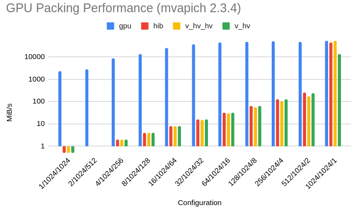
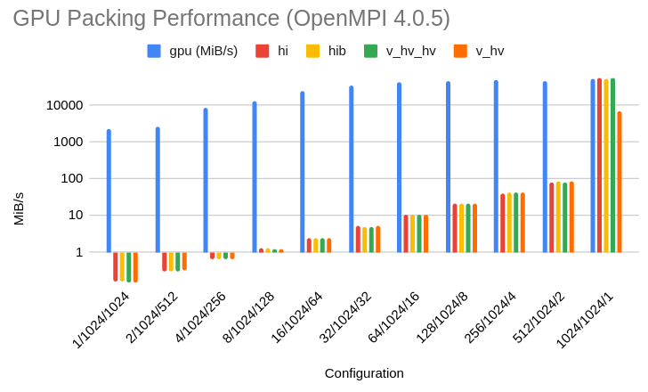
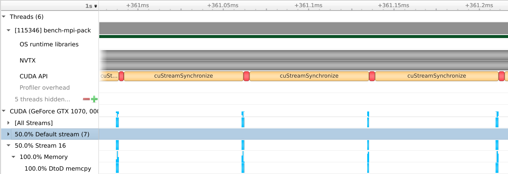

+++
title = "MPI_Pack performance on GPUs"
subtitle = ""
date = 2020-10-06T00:00:00
lastmod = 2020-10-06T00:00:00
draft = false

# Authors. Comma separated list, e.g. `["Bob Smith", "David Jones"]`.
authors = ["Carl Pearson"]

tags = ["GPU", "MPI", "CUDA", "MPI_Pack"]

summary = ""

# Projects (optional).
#   Associate this post with one or more of your projects.
#   Simply enter your project's folder or file name without extension.
#   E.g. `projects = ["deep-learning"]` references 
#   `content/project/deep-learning/index.md`.
#   Otherwise, set `projects = []`.
projects = ["stencil"]

# Featured image
# To use, add an image named `featured.jpg/png` to your project's folder. 
[image]
  # Caption (optional)
  caption = ""

  # Focal point (optional)
  # Options: Smart, Center, TopLeft, Top, TopRight, Left, Right, BottomLeft, Bottom, BottomRight
  focal_point = "Center"

  # Show image only in page previews?
  preview_only = true


categories = []

# Set captions for image gallery.


+++

*this post is still a work in progress*

# Abstract

Roll your own MPI packing and unpacking on GPUs for a **10,000x** speedup.

# Background

`MPI_Pack` and `MPI_Unpack` are commonly-used MPI library functions for dealing with non-contiguous data.
Through the `MPI_Type*` class of function, datatypes may be recursively described in terms of the basic MPI datatypes (`MPI_FLOAT`, etc), and then MPI functions may be called on those types, removing the burden of indexing, offsets, and alignment from the user.

This is a fundamental operation in MPI, where we often prefer to send one larger message rather than many small messages.
Instead of `MPI_Send`ing each value, we first pack separate values into a contiguous memory space to form larger messages.

The case examined here is using MPI's types to describe a 3D object to be packed into a single contiguous buffer.

The total source allocation is 1 GiB in which a 1024x1024x1024 cube of 1-byte elements is stored in XYZ order (adjacent elements in memory are adjacent in X).

When a subset of that region is packed, this introduces strided memory reads. For example, a (100, 200, 300) region would be represented in memory as 100 contiguous bytes, separated by 924 (1024-100) bytes before the next group of 100 contiguous bytes begins.
This pattern would be repeated 200 times to form a single XY plane of the cube.
The entire cube is made up of 300 of those planes, each starting 1024*1024 bytes from the start of the previous plane.

We examine 4 different ways of describing the 3D structure to MPI, and also include a custom GPU kernel.

The test code can be found at https://github.com/cwpearson/stencil in `bin/bench_mpi_pack.cu`.

**v_hv_hv** *(vector-hvector-hvector)*

Here, we use `MPI_Type_vector` to describe the contiguous bytes in a row in a new type `rowType`.
`MPI_Type_create_hvector` is applied to that, to describe the strided rows that make up a plane in `planeType`, and then again the strided planes that make up a cube in `fullType`.
```c++
  MPI_Datatype rowType = {};
  MPI_Datatype planeType = {};
  MPI_Datatype fullType = {};
  {
    {
      {
        // number of blocks
        int count = ce.width;
        // number of elements in each block
        int blocklength = 1;
        // number of elements between the start of each block
        const int stride = 1;
        MPI_Type_vector(count, blocklength, stride, MPI_BYTE, &rowType);
        MPI_Type_commit(&rowType);
      }
      int count = ce.height;
      int blocklength = 1;
      // bytes between start of each block
      const int stride = ae.width;
      MPI_Type_create_hvector(count, blocklength, stride, rowType, &planeType);
      MPI_Type_commit(&planeType);
    }
    int count = ce.depth;
    int blocklength = 1;
    // bytes between start of each block
    const int stride = ae.width * ae.height;
    MPI_Type_create_hvector(count, blocklength, stride, planeType, &fullType);
    MPI_Type_commit(&fullType);
  }
```

**v_hv** *(vector-hvector)*

Here, we remove one `hvector` from the hierarchy by using `MPI_Type_vector` to directly describe the strided blocks of bytes that make up a plane.
`MPI_Type_create_hvector` is again used to represent the cube.
```c++
  MPI_Datatype planeType = {};
  MPI_Datatype fullType = {};
  {
    {
      // number of blocks
      int count = ce.height;
      // number of elements in each block
      int blocklength = ce.width;
      // elements between start of each block
      const int stride = ae.width;
      MPI_Type_vector(count, blocklength, stride, MPI_BYTE, &planeType);
      MPI_Type_commit(&planeType);
    }
    int count = ce.depth;
    int blocklength = 1;
    // bytes between start of each block
    const int stride = ae.width * ae.height;
    MPI_Type_create_hvector(count, blocklength, stride, planeType, &fullType);
    MPI_Type_commit(&fullType);
  }
```

**hi** *(hindexed)*

Here, we use `MPI_Type_create_hindexed` to describe the cube.
Each contiguous row is a block, and we provide the library function with an array of block lengths (all the same) and block offsets.

```c++
  MPI_Datatype fullType = {};
  // z*y rows
  const int count = copyExt.z * copyExt.y;

  // byte offset of each row
  MPI_Aint *const displacements = new MPI_Aint[count];
  for (int64_t z = 0; z < copyExt.z; ++z) {
    for (int64_t y = 0; y < copyExt.y; ++y) {
      MPI_Aint bo = z * allocExt.y * allocExt.x + y * allocExt.x;
      // std::cout << bo << "\n";
      displacements[z * copyExt.y + y] = bo;
    }
  }
  // each row is the same length
  int *const blocklengths = new int[count];
  for (int i = 0; i < count; ++i) {
    blocklengths[i] = copyExt.x;
  }

  MPI_Type_create_hindexed(count, blocklengths, displacements, MPI_BYTE, &fullType);
  MPI_Type_commit(&fullType);
```
**hib** *(hindexed_block)*

`MPI_Type_create_hindexed_block` is the same as `MPI_Type_create_hindexed` except each block length must be a constant.

```c++
  MPI_Datatype fullType = {};
  // z*y rows
  const int count = copyExt.z * copyExt.y;
  const int blocklength = copyExt.x;

  // byte offset of each row
  MPI_Aint *const displacements = new MPI_Aint[count];
  for (int64_t z = 0; z < copyExt.z; ++z) {
    for (int64_t y = 0; y < copyExt.y; ++y) {
      MPI_Aint bo = z * allocExt.y * allocExt.x + y * allocExt.x;
      // std::cout << bo << "\n";
      displacements[z * copyExt.y + y] = bo;
    }
  }

  MPI_Type_create_hindexed_block(count, blocklength, displacements, MPI_BYTE, &fullType);
  MPI_Type_commit(&fullType);
  return fullType;
```

**kernel**

The final comparison is a custom GPU kernel that can directly read from the source memory and compute the propery offsets in the device buffer, consistent with `MPI_Pack`.

```c++
__device__ void grid_pack(void *__restrict__ dst, const cudaPitchedPtr src,
                          const Dim3 srcPos,    // logical offset into the 3D region, in elements
                          const Dim3 srcExtent, // logical extent of the 3D region to pack, in elements
                          const size_t elemSize // size of the element in bytes
) {

  const char *__restrict__ sp = static_cast<char *>(src.ptr);

  const unsigned int tz = blockDim.z * blockIdx.z + threadIdx.z;
  const unsigned int ty = blockDim.y * blockIdx.y + threadIdx.y;
  const unsigned int tx = blockDim.x * blockIdx.x + threadIdx.x;

  for (unsigned int zo = tz; zo < srcExtent.z; zo += blockDim.z * gridDim.z) {
    unsigned int zi = zo + srcPos.z;
    for (unsigned int yo = ty; yo < srcExtent.y; yo += blockDim.y * gridDim.y) {
      unsigned int yi = yo + srcPos.y;
      for (unsigned int xo = tx; xo < srcExtent.x; xo += blockDim.x * gridDim.x) {
        unsigned int xi = xo + srcPos.x;

        // logical offset of packed output
        const size_t oi = zo * srcExtent.y * srcExtent.x + yo * srcExtent.x + xo;
        // printf("[xo, yo, zo]->oi = [%u, %u, %u]->%lu\n", xo, yo, zo, oi);
        // byte offset of input
        const size_t bi = zi * src.ysize * src.pitch + yi * src.pitch + xi * elemSize;
        // printf("[xi, yi, zi]->bi = [%u, %u, %u]->%lu\n", xi, yi, zi, bi);
        if (1 == elemSize) {
          char v = *reinterpret_cast<const char *>(sp + bi);
          reinterpret_cast<char *>(dst)[oi] = v;
        } else if (4 == elemSize) {
          uint32_t v = *reinterpret_cast<const uint32_t *>(sp + bi);
          reinterpret_cast<uint32_t *>(dst)[oi] = v;
        } else if (8 == elemSize) {
          uint64_t v = *reinterpret_cast<const uint64_t *>(sp + bi);
          reinterpret_cast<uint64_t *>(dst)[oi] = v;
        } else {
          char *pDst = reinterpret_cast<char *>(dst);
          memcpy(&pDst[oi * elemSize], sp + bi, elemSize);
        }
      }
    }
  }
}
```

# Method

Each operation is executed 5 times, and the trimean is reported.
For MPI_Pack, the measured time begins when MPI_Pack is called and ends after a subsequent `cudaDeviceSynchronize`.
This is necessary as the CUDA-aware MPI_Pack may be asynchronous w.r.t. the CPU, as the implementation may insert future CUDA operations into the same stream to ensure their ordering.
For the GPU kernel, the measured time begins at the kernel invocation and ends after a subsequent `cudaDeviceSynchronize`.

The following table describes the evaluation system

|Component|Value|
|-|-|
|OS|Linux 5.8.0-2-amd64|
|CUDA|11.1.74|
|Nvidia Driver|455.23.05|
|gcc|10.2.0|
|CPU|Ryzen 7 3700X|
|GPU|Nvidia GTX 1070|

The GPU is also driving 2 4k 60Hz displays used as the desktop during these tests.

The following MPI implementations were built with gcc and the following configuration options:

|Implementation| `configure` flags|
|-|-|
|OpenMPI 4.0.5| `--with-cuda=/usr/local/cuda` |
|mvapich 2.3.4| `--enable-cuda --with-cuda=/usr/local/cuda --enable-fortran=no --disable-mcast` |
|mpich 3.4a3| *failed to configure* |

I was unable to compile mpich 3.4a3 with GPU support.
Hopefully I can revisit that soon.

# Results

In both results, the "configuration" refers to the X/Y/Z size of the region copied out of a 1024x1024x1024 byte allocation.
The total packing size is kept constant at 1MiB.

First, the results for mvapich-2.3.4:



And for for openMPI-4.0.5:



# Discussion

In most cases, the GPU kernel is **100-10,000x** faster than OpenMPI and **30x-3000x** faster than mvapich.


The two images below are taken from the Nsight Systems profiling tool.
It creates a timeline on which GPU activity and CUDA calls are shown.
For mvapich, each contiguous block is transferred using a call to cudaMemcpyAsync.
This means that one cudaMemcpyAsync call is generated for each row.
As we can see, that actuall call takes much more time than the corresponding GPU activity, causing the slow performance.


**strided mvapich**


The OpenMPI situation is much worse - for some reason, the CPU is forced to synchronize with the device after each copy, decreasing the performance even further.

**strided openmpi**


When the nature of the copy causes the source memory to be contiguous, there is a single cudaMemcpyAsync call, which is much faster than the GPU kernel.
(5 copies are shown due to 5 measurement iterations).
Here, we can also see that OpenMPI's unnecessary synchronizations degrade performance by causing the GPU to be idle.

**contiguous mvapich**


**contiguous openmpi**


The GPU kernel performance is limited by inefficient use of DRAM bandwidth.
For example, when loading a single byte separated by hundreds of bytes, most of each 128B cache line is wasted.
For the contiguous 1 MiB transfers, where the kernel is slower, performance is limited by each 32-thread warp collaboartively loading 32B.

# Conclusion

Despite this being an open problem for years, it seems there is much work to do on fast handling of MPI datatypes on GPUs.
Even relatively simple cases such as strided tensors behave very poortly.

MPI implementors should probably analyze the datatypes at `MPI_Type_commit` to determine if there is a high-performance way to handle pack and unpack.
Future uses of that datatype should use the appropriate fast path, dropping back to cudaMemcpyAsync when no better option is available.