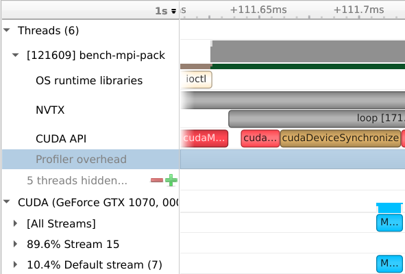
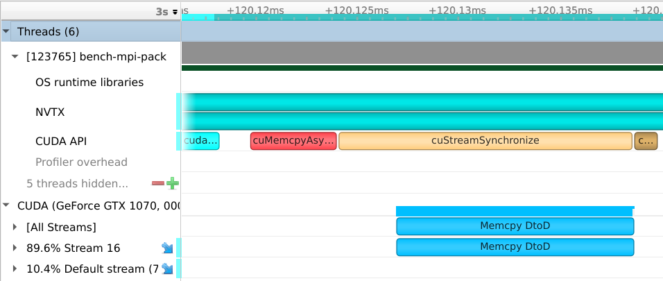

+++
title = "Improving MPI_Pack performance in CUDA-aware MPI"
date = 2020-10-06T00:00:00
lastmod = 2020-10-06T00:00:00
draft = false

# Authors. Comma separated list, e.g. `["Bob Smith", "David Jones"]`.
authors = ["Carl Pearson"]

tags = ["GPU", "MPI", "CUDA", "MPI_Pack"]

summary = ""

# Projects (optional).
#   Associate this post with one or more of your projects.
#   Simply enter your project's folder or file name without extension.
#   E.g. `projects = ["deep-learning"]` references 
#   `content/project/deep-learning/index.md`.
#   Otherwise, set `projects = []`.
projects = ["stencil"]

# Featured image
# To use, add an image named `featured.jpg/png` to your project's folder. 
[image]
  # Caption (optional)
  caption = ""

  # Focal point (optional)
  # Options: Smart, Center, TopLeft, Top, TopRight, Left, Right, BottomLeft, Bottom, BottomRight
  focal_point = "Center"

  # Show image only in page previews?
  preview_only = true


categories = []

# Set captions for image gallery.


+++

# Abstract

Roll your own MPI packing and unpacking on GPUs for a **10,000x** speedup.
I am working on an MPI wrapper library to integrate these changes (and other research results) into existing MPI code with no source changes.
Please contact me if you are interested in trying it out.

# Background

`MPI_Pack` and `MPI_Unpack` are commonly-used MPI library functions for dealing with non-contiguous data.
Through the `MPI_Type*` class of function, datatypes may be recursively described in terms of the basic MPI datatypes (`MPI_FLOAT`, etc), and then MPI functions may be called on those types, removing the burden of indexing, offsets, and alignment from the user.

This is a fundamental operation in MPI, where we often prefer to send one larger message rather than many small messages.
Instead of `MPI_Send`ing each value, we first pack separate values into a contiguous memory space to form larger messages.

The case examined here is using MPI's types to describe a 3D object to be packed into a single contiguous buffer.

The total source allocation is 1 GiB in which a 1024x1024x1024 cube of 1-byte elements is stored in XYZ order (adjacent elements in memory are adjacent in X).

When a subset of that region is packed, this introduces strided memory reads. For example, a (100, 200, 300) region would be represented in memory as 100 contiguous bytes, separated by 924 (1024-100) bytes before the next group of 100 contiguous bytes begins.
This pattern would be repeated 200 times to form a single XY plane of the cube.
The entire cube is made up of 300 of those planes, each starting 1024*1024 bytes from the start of the previous plane.

We examine 4 different ways of describing the 3D structure to MPI, and also include a custom GPU kernel.

The test code can be found at https://github.com/cwpearson/stencil in `bin/bench_mpi_pack.cu`.

**v_hv_hv** *(vector-hvector-hvector)*

Here, we use `MPI_Type_vector` to describe the contiguous bytes in a row in a new type `rowType`.
`MPI_Type_create_hvector` is applied to that, to describe the strided rows that make up a plane in `planeType`, and then again the strided planes that make up a cube in `fullType`.
```c++
  MPI_Datatype rowType = {};
  MPI_Datatype planeType = {};
  MPI_Datatype fullType = {};
  {
    {
      {
        // number of blocks
        int count = ce.width;
        // number of elements in each block
        int blocklength = 1;
        // number of elements between the start of each block
        const int stride = 1;
        MPI_Type_vector(count, blocklength, stride, MPI_BYTE, &rowType);
        MPI_Type_commit(&rowType);
      }
      int count = ce.height;
      int blocklength = 1;
      // bytes between start of each block
      const int stride = ae.width;
      MPI_Type_create_hvector(count, blocklength, stride, rowType, &planeType);
      MPI_Type_commit(&planeType);
    }
    int count = ce.depth;
    int blocklength = 1;
    // bytes between start of each block
    const int stride = ae.width * ae.height;
    MPI_Type_create_hvector(count, blocklength, stride, planeType, &fullType);
    MPI_Type_commit(&fullType);
  }
```

**v_hv** *(vector-hvector)*

Here, we remove one `hvector` from the hierarchy by using `MPI_Type_vector` to directly describe the strided blocks of bytes that make up a plane.
`MPI_Type_create_hvector` is again used to represent the cube.
```c++
  MPI_Datatype planeType = {};
  MPI_Datatype fullType = {};
  {
    {
      // number of blocks
      int count = ce.height;
      // number of elements in each block
      int blocklength = ce.width;
      // elements between start of each block
      const int stride = ae.width;
      MPI_Type_vector(count, blocklength, stride, MPI_BYTE, &planeType);
      MPI_Type_commit(&planeType);
    }
    int count = ce.depth;
    int blocklength = 1;
    // bytes between start of each block
    const int stride = ae.width * ae.height;
    MPI_Type_create_hvector(count, blocklength, stride, planeType, &fullType);
    MPI_Type_commit(&fullType);
  }
```

**hi** *(hindexed)*

Here, we use `MPI_Type_create_hindexed` to describe the cube.
Each contiguous row is a block, and we provide the library function with an array of block lengths (all the same) and block offsets.

```c++
  MPI_Datatype fullType = {};
  // z*y rows
  const int count = copyExt.z * copyExt.y;

  // byte offset of each row
  MPI_Aint *const displacements = new MPI_Aint[count];
  for (int64_t z = 0; z < copyExt.z; ++z) {
    for (int64_t y = 0; y < copyExt.y; ++y) {
      MPI_Aint bo = z * allocExt.y * allocExt.x + y * allocExt.x;
      // std::cout << bo << "\n";
      displacements[z * copyExt.y + y] = bo;
    }
  }
  // each row is the same length
  int *const blocklengths = new int[count];
  for (int i = 0; i < count; ++i) {
    blocklengths[i] = copyExt.x;
  }

  MPI_Type_create_hindexed(count, blocklengths, displacements, MPI_BYTE, &fullType);
  MPI_Type_commit(&fullType);
```
**hib** *(hindexed_block)*

`MPI_Type_create_hindexed_block` is the same as `MPI_Type_create_hindexed` except each block length must be a constant.

```c++
  MPI_Datatype fullType = {};
  // z*y rows
  const int count = copyExt.z * copyExt.y;
  const int blocklength = copyExt.x;

  // byte offset of each row
  MPI_Aint *const displacements = new MPI_Aint[count];
  for (int64_t z = 0; z < copyExt.z; ++z) {
    for (int64_t y = 0; y < copyExt.y; ++y) {
      MPI_Aint bo = z * allocExt.y * allocExt.x + y * allocExt.x;
      // std::cout << bo << "\n";
      displacements[z * copyExt.y + y] = bo;
    }
  }

  MPI_Type_create_hindexed_block(count, blocklength, displacements, MPI_BYTE, &fullType);
  MPI_Type_commit(&fullType);
  return fullType;
```

**kernel**

The final comparison is a custom GPU kernel that can directly read from the source memory and compute the proper offsets in the device buffer, consistent with `MPI_Pack`.

A key component of the performance of the kernel is the chosen block and grid dimensions.
The block is sized to distribute a chosen number of threads across the X, Y, and Z dimension, filling X then Y, then Z until the available threads are exhausted.
The grid dimension is then used to tile the blocks across the entire 3D region to be packed.
Without such intelligent sizing, each thread will execute many loop iterations, drastically reducing performance.

Further improvement is gained by specializing the kernel call according to the blockLength.
Groups of sequential X-threads collaborate to load the `blockLength`-long chunks.
If the blockLength can be evenly divided by a larger word size, that size is used.

```c++
template <unsigned N>
__global__ static void pack_bytes_n(
    void *__restrict__ outbuf, int position, const void *__restrict__ inbuf,
    const int incount,
    unsigned blockLength, // block length (B)
    unsigned count0,      // count of inner blocks in a group
    unsigned stride0,     // stride (B) between start of inner blocks in group
    unsigned count1,      // number of block groups
    unsigned stride1      // stride (B) between start of block groups
) {

  assert(blockLength % N == 0); // N should evenly divide block length

  const unsigned int tz = blockDim.z * blockIdx.z + threadIdx.z;
  const unsigned int ty = blockDim.y * blockIdx.y + threadIdx.y;
  const unsigned int tx = blockDim.x * blockIdx.x + threadIdx.x;

  char *__restrict__ op = reinterpret_cast<char *>(outbuf);
  const char *__restrict__ ip = reinterpret_cast<const char *>(inbuf);

  for (int i = 0; i < incount; ++i) {
    char *__restrict__ dst = op + position + i * count1 * count0 * blockLength;
    const char *__restrict__ src = ip + i * stride1 * count1 * stride0 * count0;

    for (unsigned z = tz; z < count1; z += gridDim.z * blockDim.z) {
      for (unsigned y = ty; y < count0; y += gridDim.y * blockDim.y) {
        for (unsigned x = tx; x < blockLength / N;
             x += gridDim.x * blockDim.x) {
          unsigned bo = z * count0 * blockLength + y * blockLength + x * N;
          unsigned bi = z * stride1 + y * stride0 + x * N;
          // printf("%u -> %u\n", bi, bo);

          if (N == 1) {
            dst[bo] = src[bi];
          } else if (N == 2) {
            uint16_t *__restrict__ d = reinterpret_cast<uint16_t *>(dst + bo);
            const uint16_t *__restrict__ s =
                reinterpret_cast<const uint16_t *>(src + bi);
            *d = *s;
          } else if (N == 4) {
            uint32_t *__restrict__ d = reinterpret_cast<uint32_t *>(dst + bo);
            const uint32_t *__restrict__ s =
                reinterpret_cast<const uint32_t *>(src + bi);
            *d = *s;
          } else if (N == 8) {
            uint64_t *__restrict__ d = reinterpret_cast<uint64_t *>(dst + bo);
            const uint64_t *__restrict__ s =
                reinterpret_cast<const uint64_t *>(src + bi);
            *d = *s;
          }
        }
      }
    }
  }
}
```

# Method

Each operation is executed 5 times, and the trimean is reported.
For MPI_Pack, the measured time begins when MPI_Pack is called and ends after a subsequent `cudaDeviceSynchronize`.
This is necessary as the CUDA-aware MPI_Pack may be asynchronous w.r.t. the CPU, as the implementation may insert future CUDA operations into the same stream to ensure their ordering.
The GPU time includes any time required to set up the kernel launch.

The following table describes the evaluation system

|Component|Value|
|-|-|
|OS|Linux 5.8.0-2-amd64|
|CUDA|11.1.74|
|Nvidia Driver|455.23.05|
|gcc|10.2.0|
|CPU|Ryzen 7 3700X|
|GPU|Nvidia GTX 1070|

The GPU is also driving 2 4k 60Hz displays used as the desktop during these tests.

The following MPI implementations were built with gcc and the following configuration options:

|Implementation| `configure` flags|
|-|-|
|OpenMPI 4.0.5| `--with-cuda=/usr/local/cuda` |
|mvapich 2.3.4| `--enable-cuda --with-cuda=/usr/local/cuda --enable-fortran=no --disable-mcast` |
|mpich 3.4a3| *failed to configure* |

I was unable to compile mpich 3.4a3 with GPU support.
Hopefully I can revisit that soon.

# Results

In both results, the "configuration" refers to the X/Y/Z size of the region copied out of a 1024x1024x1024 byte allocation.
The total packing size is kept constant at 1MiB.

First, the results for mvapich-2.3.4:


And for for openMPI-4.0.5:


# Discussion

In most cases, the GPU kernel is **100-10,000x** faster than OpenMPI and **30x-3000x** faster than mvapich.
It matches the underlying MPI_Pack performance when the region to be packed is already contiguous.


The two images below are taken from the Nsight Systems profiling tool.
It creates a timeline on which GPU activity and CUDA calls are shown.
For mvapich, each contiguous block is transferred using a call to `cudaMemcpyAsync`.
This means that one `cudaMemcpyAsync` call is generated for each `blockLength` chunk.
As we can see, that actual call takes much more time than the corresponding GPU activity, causing the slow performance.


**strided mvapich**


The OpenMPI situation is much worse - for some reason, the CPU is forced to synchronize with the device after each copy, decreasing the performance even further.

**strided openmpi**


When the nature of the copy causes the source memory to be contiguous, there is a single cudaMemcpyAsync call, which makes as effective use of the GPU bandwidth as the GPU kernel does.

**contiguous mvapich**



**contiguous openmpi**


The GPU kernel performance is limited by inefficient use of DRAM bandwidth.
For example, when loading a single byte separated by hundreds of bytes, most of each 128B cache line is wasted.

# Conclusion

Despite this being an open problem for years, it seems there is much work to do on fast handling of MPI datatypes on GPUs.
Even relatively simple cases such as strided tensors behave very poortly.

MPI implementors should probably analyze the datatypes at `MPI_Type_commit` to determine if there is a high-performance way to handle pack and unpack.
Future uses of that datatype should use the appropriate fast path, dropping back to cudaMemcpyAsync when no better option is available.